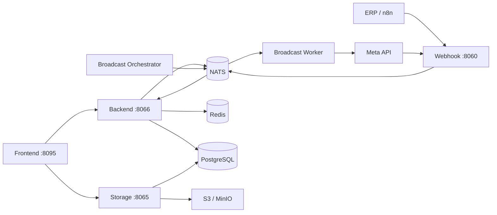

# Omni Chan Architecture

```mermaid
graph LR

Frontend["Frontend :8095"]

Backend["Backend :8066"]

Webhook["Webhook :8060"]

Storage["Storage :8065"]

BroadcastOrchestrator["Broadcast Orchestrator"]

BroadcastWorker["Broadcast Worker"]

NATS[(NATS)]

Redis[(Redis)]

Postgres[(PostgreSQL)]

Meta["Meta API"]

External["ERP / n8n"]

S3["S3 / MinIO"]

Frontend --> Backend
Frontend --> Storage

External --> Webhook
Meta --> Webhook

Webhook --> NATS

Backend --> Postgres
Backend --> Redis
Backend --> NATS

BroadcastOrchestrator --> NATS

NATS --> BroadcastWorker
NATS --> Backend

BroadcastWorker --> Meta

Storage --> Postgres
Storage --> S3
```